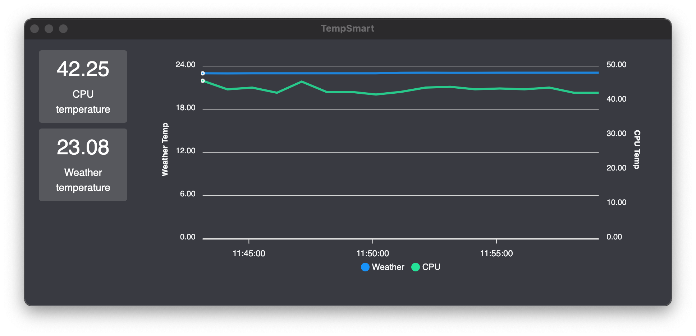

# TempSmart



## Installing

Install dependencies:

```shell
yarn
```

Start a development build:

```shell
yarn dev
```

Create a production build:

```shell
yarn package
```

## Usage

Search for a city when prompted and select it from the suggestions.
All the 20000 cities supported by OpenWeatherMap are available.

TempSmart has been tested on Windows and MacOS.

Some Windows machines restrict the access to the CPU temperature and might not return a valid value.

## Tests

You can run the tests with `jest` via the following command

```shell
yarn dev
```

Renderer tests user `@testing-library/react` to test the DOM

## Development

The dev server uses the port 4000 so make sure that's available.

## TODO

Things I might have done more:

-   Run in the background
-   Better chart implementation and testing (apexcharts doesn't play nice with jest-dom)
-   Better setup of the app/window
-   More testing
-   Fetch list of cities from an API
-   Put the OWM API behind a proxy

## Conclusion

Thank you for the fun challenge!
